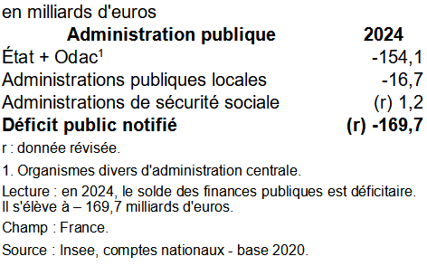

::: callout-note
## Mots clés

Intervention économique de l'Etat - Déficit - Dette
:::

# Politique économique de l'Etat

::: slide
## Les trois fonctions de l'Etat:

-   Allocation des ressources: l'Etat réalise des dépenses pour entretenir son administration et financer les biens collectifs (défense, infrastructures ...)

-   Redistribution: Vers l'égalité d'accès des citoyens à certaines ressources

-   Régulation: Soutenir l'activité économique
:::

::::::: slide
## Les objectifs de la politique économique de l'Etat:

```{r}
# Étape 1 : Préparer les données 
data_france <- data.frame( periode = c("2000", "2005", "2010", "2015", "2020"), 
croissance = c(3.0, 2.5, 1.2, 1.8, -0.5),  # Croissance économique (%)  
emploi = c(93, 91, 89, 87, 85),           # Taux d'emploi (%)
prix = c(1.5, 2.0, 1.8, 1.6, 0.5),        # Inflation (%) 
commerce = c(0.2, -0.5, -1.0, -1.5, -2.0))
# Balance commerciale (% du PIB) ) 
# Étape 2 : Normaliser les données
normalize <- function(x) 
  {   (x - min(x)) / (max(x) - min(x)) } 
data_normalized <- data_france 
data_normalized[, -1] <- as.data.frame(lapply(data_france[, -1], normalize))  # Étape 3 : Préparer les données pour le graphique radar # Installer et charger le package fmsb si nécessaire  
library(fmsb)  
radar_data <- rbind(   rep(1, 4),  # Valeurs maximales après normalisation 
rep(0, 4),  # Valeurs minimales après normalisation 
data_normalized[, -1] ) # Données normalisées ) 
# Nommer les colonnes pour le graphique radar 
colnames(radar_data) <- c("Croissance", "Emploi", "Prix", "Commerce")
rownames(radar_data) <- c("Max", "Min", data_france$periode)  # Étape 4 : Tracer le carré magique 
radarchart(   radar_data,   axistype = 1,   pcol = rainbow(nrow(data_france)),  # Couleurs pour chaque période  
              pfcol = rainbow(nrow(data_france), alpha = 0.4),  # Couleurs remplies  
              plwd = 2,  # Épaisseur des lignes  
              cglcol = "grey", cglty = 1, axislabcol = "black", caxislabels = seq(0, 1, 0.2),   title = "Carré magique de Kaldor - France à différentes périodes" )  # Ajouter une légende 
legend("topright",   
        legend = data_france$periode, 
        col = rainbow(nrow(data_france)),  
        lty = 1, lwd = 2 )
```

::: slide
## Justifications de l'Etat minimal : les Classiques

Les Classiques prônent une intervention minimale de l'Etat dans l'économie [@saberan_notion_2008]

## Citation

« Le troisième et dernier devoir du souverain ou de la république est celui d’élever et d’entretenir ces ouvrages et ces établissements publics dont une grande société retire d’immense avantages, mais qui sont néanmoins de nature à ne pouvoir être entrepris ou entretenus par un ou par quelques particuliers, attendu que pour ceux-ci, le profit ne saurait jamais leur en rembourser la dépense. Ce devoir exige aussi, pour le remplir, des dépenses dont l’étendue varie selon les divers degrés de la société. Après les travaux et les établissements publics nécessaires pour la défense de la société et pour l’administration de la justice, deux objets dont nous avons parlé, les autres travaux et établissements de ce genre sont principalement ceux pour faciliter le commerce de la société, et ceux destinés à étendre l’instruction parmi le peuple ».

***A Smith « Recherches sur la nature et les causes de la richesse des nations », 1776, livre V, chapitre I.***
:::

::: slide
## Remédier aux défaillances de marché

### Les Externalités

Définition: Situation dans laquelle la consommation ou la production d'un agent influe positivement ou négativement sur l'utilité d'un autre agent, sans que cette intéraction ne transite par le marché, c'est à dire par le mécanisme des prix.

L'origine des externalités réside dans l'imperfection des droits de propriété.

Dans le cas d'une externalité négative, le coût marginal privé est inférier au coût marginal social .
:::

::: slide
## Les Biens Publics

|   | Excluabilité | Non Excluabilité |
|------------------------|------------------------|------------------------|
| **Rivalité** | Biens Privatifs (ex: aliments, vêtements ...) | Biens Communs (ex: Ressources marines...) |
| **Non Rivalité** | Biens de Club (ex: autoroute) | Biens Collectifs (ex: Radio, défense nationale ...) |
:::

::: slide
## Biens collectifs et comportements de Free Rider

Un des problèmes des biens collectifs est que le libre jeu du marché peut conduire à une situation non-optimale car les individus sont tentés de se comporter en *Free Rider.*

|              |          |              |
|:------------:|:--------:|:------------:|
|              |  payer   | ne pas payer |
|    payer     | (10, 10) |    (2,15)    |
| ne pas payer |  (15,2)  |    (5,5)     |

: Bien collectif et dilemme du prisonnier
:::
:::::::

:::: slide
::: slide
## Justifications d'une intervention prononcée de l'Etat: l'analyse keynésienne

## Le modèle IS-LM
:::
::::

# Faits stylisés

## Le budget de l'Etat

Pour présenter le budget de l'Etat, nous nous référons au site [suivant](https://www.haut-rhin.gouv.fr/Actions-de-l-Etat/Economie-et-emploi/Comment-fonctionne-le-budget-de-l-Etat)

## Capacités ou besoin de financement des Administrations Publiques en 2024



### Les recettes

Les impôts et les taxes (dont TVA)

```{r}
# Charger les bibliothèques  
library(readxl)   
library(ggplot2) 
library(plotly)   
donnees <- read_excel("donnees.xls")   
donnees <- donnees[-1,]  
donnees$Valeur<- donnees$`Évaluations 2024 révisées`  # Ajouter une colonne pour le pourcentage  
donnees$Pourcentage <- round(donnees$Valeur / sum(donnees$Valeur) * 100, 1)  
p_interactif <- plot_ly(donnees, labels = ~Recette, values = ~Valeur, type = "pie",                         textinfo = "label+percent", hoverinfo = "label+percent+value",                         marker = list(line = list(color = "#FFFFFF", width = 1))) %>%   layout(title = "Répartition des Recettes")   
p_interactif
```

Source: Ministère de l'Economie, des Finances et de l'Industrie, projet de loi de finances 2025

### Les Dépenses

```{r}
library(readxl) 
library(plotly) 
depenses <- read_excel("depenses.xlsx") 
depenses$depenses<-depenses$`Dépenses publiques`   # Création du camembert interactif avec plotly
p_interactif2 <- plot_ly(depenses, labels = ~Structure, values = ~depenses, type = "pie",textinfo = "label+percent", hoverinfo = "label+percent+value",  marker = list(line = list(color = "#FFFFFF", width = 1))) %>%     layout(title = "Répartition des Dépenses")  # Afficher le graphique interactif p_interactif2 
p_interactif2
```

Source: Insee, comptes nationaux - base 2020.

### Evolution du solde budgétaire

```{r}
dette <- read_excel("dette.xls") 
dette$year<-dette$Année 
dette$deficit<-dette$`Déficit public notifié` 
ggplot(dette, aes(x =year, y = deficit)) +   geom_line(color = "blue", size = 1) +  geom_hline(yintercept = -3, linetype = "dashed", color = "orange", size = 1) +     scale_y_continuous(limits = c(-10, 2), name = "en % du PIB") +    labs(title = "Solde des finances Publiques",        x = "Année") +   theme_minimal()  
```

Source: Insee, Comptes nationaux, base 2020

### Evolution des dépenses et recettes

```{r}
recettes <- read_excel("recettes.xls") # Création du graphique avec ggplot2  
ggplot(recettes, aes(x = year)) +    geom_line(aes(y = Depenses, color = "Dépenses Publiques"), size = 1.2) +    geom_line(aes(y = Recettes, color = "Recettes"), size = 1.2) +     scale_color_manual(values = c("Dépenses Publiques" = "blue", "Recettes" = "orange")) +   labs(title = "Évolution des Dépenses et Recettes Publiques",        x = "Année",        y = "Valeurs (% du PIB)",        color = "Légende") +   theme_minimal() +    theme(text = element_text(size = 12))
```

Source: Insee comptes nationaux -base 2020

```{r}

library(readxl)

deficit_europe <-read_excel("deficit_europe.xls") 
deficit_europe$deficit <- deficit_europe$`Solde des finances publiques
(en % du PIB)`  

library(ggplot2)
ggplot(deficit_europe, aes(x = reorder(Pays, deficit), y = deficit)) +   
  geom_bar(stat = "identity", fill = "steelblue") +    coord_flip() +    
  labs(title = "Déficit par pays", x = "Pays", y = "Déficit (% du PIB)") +   
  theme_minimal()
```

Source: Banque centrale européenne ; Eurostat

## Les règles qui régissent le budget de l'Etat

### Les principes budgétaires

le budget doit répondre à plusieurs principes budgétaires comme **l'universalité, l'unité, la spécialité et l'annualité.**

-   **L’universalité budgétaire** de l’État, signifie que, normalement — sauf pour quelques exceptions —, toutes les recettes doivent alimenter le budget de l’État sans être affectées à une dépense précise. C’est un grand pot commun qui permet d’alimenter toutes les politiques publiques sans distinction.

-   Le budget de l’État doit aussi être présenté dans un **document unique** avec toutes les dépenses et toutes les recettes. Ce document doit être le plus exhaustif possible. C’est un enjeu de lisibilité et de transparence pour les citoyens et pour permettre au Parlement, qui va ensuite voter ce texte, de travailler efficacement.

-   Le budget doit également détailler l’autorisation des crédits par **destination**, c’est-à-dire qu’une dépense va être prévue dans un but défini, c’est le principe de **spécialité**.

-   Le dernier principe, c’est **l’annualité**. Chaque année, on détermine les recettes et les dépenses pour une année. Le budget tient compte, bien sûr, du fait que certaines politiques publiques sont pluriannuelles. Mais on fait en sorte que chaque année, on puisse faire de la justification au premier euro, c’est-à-dire que chaque dépense puisse être justifiée annuellement.

### Les règles européennes

Le traité de Maastricht prévoit deux critères de convergence:

-   Une limitation du déficit public \< 3% du PIB

-   Un plafonnement de la dette publique, qui ne doit pas excéder 60% du PIB

## Débat

Donnez des arguments Pour et Contre une discipline budgétaire suivant ces critères définis.
