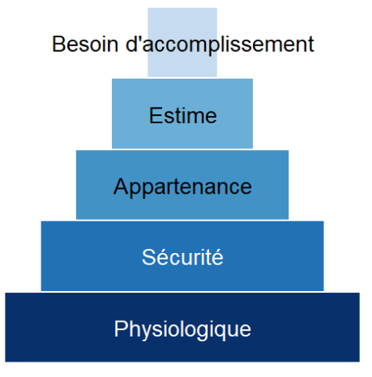

# Rareté et Allocation des Ressources

::: callout-note
## Mots clés

Allocation des ressources - Choix économique - Economie Positive et Normative - Rareté - Macroéconomie - Microéconomie
:::

# Des Ressources limitées face à des besoins illimités ...

## Definitions:

**Ressources:** Moyens matériels ou immatériels qui permettent de satisfaire les besoins des agents économiques

**Besoin:** sentiment de manque que l'on cherche à satisfaire

# La pyramide des besoins (Maslow)

# ... Qui nécessitent de faire des choix et arbitrages

Selon Samuelson, la science économique cherche à résoudre le problème de l'allocation des ressources rares.

::: callout-note
"Quels biens faut-il produire? " "Quelles quantités produire?" "Comment et pour qui produire?"
:::

Le coût d'un choix: notion de coût d'opportunité

# Distinction microéconomie/ macroéconomie

\begin{tabularx}{\textwidth}{|X|X|X|}
\hline
\rowcolor{myblue}\color{white} Domaine & Questions typiques & Exemples \\
\hline
Microéconomie & Comment un consommateur choisit-il entre deux produits ? & Choix entre alimentation et loisirs \\
Macroéconomie & Comment le PIB, l’inflation ou le chômage varient-ils d’une année sur l’autre ? & Exemple : variation annuelle du PIB \\
\hline
\end{tabularx}

# Distinction approche Positive et Normative

***Extraits de Macroéconomie, Cyriac Guillaumin, 2020***

"L’économie positive définit le monde tel qu’il est. Elle a trait aux explications objectives ou scientifiques du fonctionnement de l’économie. Son but est donc d’établir des liens entre certains faits sans aucun jugement de valeur.

Dans ce cas, l’économiste espère agir comme un scientifique rigoureux et « dépassionné ». Dans ce cadre, l’objectif de l’économiste est d’essayer de comprendre le fonctionnement de l’économie et du monde en général dans la réalité. L’analyse positive vise, par exemple, à étudier :

-   les effets d’une politique économique (augmenter les dépenses publiques par exemple) ;

-   les effets d’une réforme de la fiscalité (une hausse des taux d’imposition par exemple) ;

-   etc.

# Economie normative

"L’économie normative quant à elle définit le monde tel qu’il devrait être. Elle fournit des prescriptions ou recommandations fondées sur des jugements de valeurs personnels. L’économie normative va donc plus loin que l’économie positive. Dans ce cas, l’économiste est influencé soit par ses orientations politiques soit par ses convictions théoriques. Cette démarche ne peut donc éviter les jugements de valeurs. Dans le cadre de l’analyse normative, l’économiste adopte le rôle d’un conseiller du prince et examine quels sont les outils de politiques économiques qu’il doit mobiliser pour atteindre les objectifs souhaités. À titre d’exemple, un conseiller économique d’un ministre peut dire : « pour résorber le chômage, il faut adopter telle ou telle mesure ». Il s’agit alors de propositions : si l’on change ceci, il arrivera cela."

# Une frontière complexe

Les deux approches sont imbriquées l'une dans l'autre

Distinguer expertise et plaidoyer, connaître les différentes écoles de pensée (cf cours histoire Economique)

# Que demande-t-on à un économiste?

"What should economists do?", Buchanan, 1964

## Approche théorique

-   Fournir des représentations simplifiées de la réalité pour aider à prévoir et comprendre les phénomènes économiques

-   Repose sur des hypothèses

-   Confrontation de ces hypothèses et validation empirique

## Approche empirique

-   Utilisation de données réelles pour tester les théories économiques

-   Valider les modèles

-   Analyser des relations économiques

# Les sujets d'intérêt des économistes.

Inflation, croissance, chômage, distribution des richesses

# ... Mais également

Education, Discriminations, sport, environnement ou bien encore criminalité
