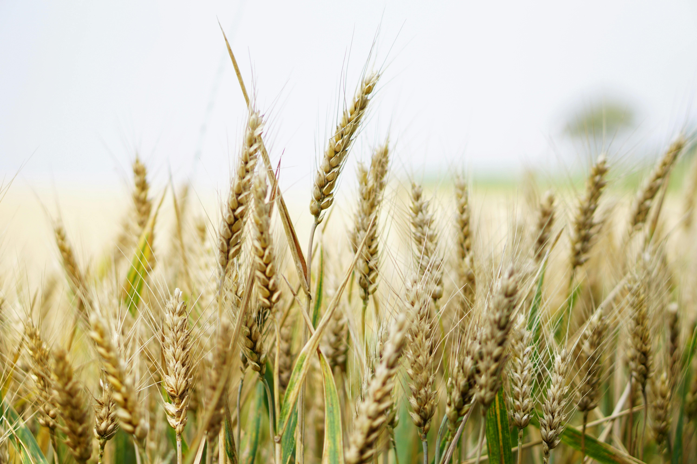

{fig-align="center" width="365"}

## Introduction

Depuis l’Antiquité, la production de blé a été limitée par la surface cultivée et les faibles rendements.

\
Après 1961, le progrès technique (mécanisation, fertilisation, sélection) a fortement augmenté les rendements.Ce projet combine des données historiques et modernes pour estimer la production globale, comparer le modèle aux données observées, et montrer comment la croissance de la production résulte à la fois de l’extension des surfaces et de l’amélioration des rendements.

La partie historique (avant 1961) est exploratoire, tandis que la période moderne permet une validation quantitative.

Ce projet combine :

-   Production historique et moderne de blé\
-   Rendements par période\
-   Comparaison estimé vs réel (1961–2023)\
-   Indice de prix historique\
-   Simulation de chocs et pénuries (guerres, sécheresse)

------------------------------------------------------------------------

###  Paramètres et hypothèses

| Période | Paramètre | Valeur / Fonction |
|------------------|---------------------|---------------------------------|
| Avant 1961 | Part de blé | 28 % |
|  | Rendement (t/ha) | avant -3000:0,4; -3000–0:0,6; 0–1500:0,7; 1500–1900:0,8; 1900–1960:1,0 |
|  | Surface cultivée | données historiques |
|  | Population | estimations historiques |
| 1961–2023 | Rendement évolutif | (R(t)=a+b\*(t-1961)), a≈0,9 t/ha, b≈0,025 t/ha/an |
|  | Part de blé | 28 % |

> Les chocs historiques simulés permettent de représenter les tensions sur le marché du blé (ex: guerre des farines).

------------------------------------------------------------------------

\`

```{r}
library(shiny)
library(shinythemes)
library(shinyWidgets)
library(tidyverse)
library(plotly)
library(rnaturalearth)
library(sf)
library(RColorBrewer)

# -----------------------------
# DONNÉES
# -----------------------------
cropland <- read_csv("cropland.csv") %>%
  rename(cropland_ha = `Land use: Cropland`) %>%
  mutate(Code = case_when(Code=="FR" ~ "FRA", Code=="US" ~ "USA", TRUE ~ Code)) %>%
  filter(!is.na(Code))

population <- read_csv("population.csv") %>%
  rename(Pop_proj=`Population (projections)`, Pop_hist=`Population (historical)`) %>%
  mutate(Population = ifelse(!is.na(Pop_hist), Pop_hist, Pop_proj),
         Code = case_when(Code=="FR" ~ "FRA", Code=="US" ~ "USA", TRUE ~ Code)) %>%
  select(Code, Year, Population) %>%
  filter(!is.na(Code))

wheat_real <- read_csv("wheat_production.csv") %>%
  rename(wheat_t_real = `Wheat | 00000015 || Production | 005510 || tonnes`) %>%
  filter(Year >= 1961)

years <- seq(min(cropland$Year), max(cropland$Year),1)
population_full <- population %>%
  group_by(Code) %>%
  complete(Year = years) %>%
  fill(Population, .direction="downup") %>%
  ungroup()

yield_historical <- function(year){
  case_when(
    year < -3000 ~ 0.4,
    year < 0     ~ 0.6,
    year < 1500  ~ 0.7,
    year < 1900  ~ 0.8,
    year < 1961  ~ 1.0
  )
}

# -----------------------------
# OPTIMISATION RENDEMENTS MODERNES
# -----------------------------
rmse_yield_time <- function(params){
  a <- params[1]; b <- params[2]
  est <- cropland %>%
    group_by(Code, Year) %>%
    summarise(cropland_ha=sum(cropland_ha), .groups="drop") %>%
    filter(Year>=1961) %>%
    left_join(population_full, by=c("Code","Year")) %>%
    mutate(yield_t_ha = a+b*(Year-1961),
           wheat_t = cropland_ha*0.28*yield_t_ha) %>%
    left_join(wheat_real, by=c("Code","Year")) %>%
    filter(!is.na(wheat_t_real))
  sqrt(mean((est$wheat_t - est$wheat_t_real)^2))
}
res <- optim(par=c(0.9,0.025), fn=rmse_yield_time, method="L-BFGS-B",
             lower=c(0.3,0), upper=c(3,0.1))
a_opt <- res$par[1]; b_opt <- res$par[2]

# -----------------------------
# Carte du monde
# -----------------------------
world <- ne_countries(scale="medium", returnclass="sf") %>%
  st_set_geometry(NULL) %>%
  select(iso_a3, name)

# Couleurs
colors_green <- rev(brewer.pal(9, "Greens"))
colors_red   <- rev(brewer.pal(9, "Reds"))

# -----------------------------
# SHINY UI
# -----------------------------
ui <- fluidPage(
  theme = shinytheme("flatly"),
  titlePanel("Blé : Production Historique"),
  sidebarLayout(
    sidebarPanel(width=3,
                 uiOutput("country_selector"),
                 sliderInput("share_wheat", "Part du blé dans les cultures", min=0.1, max=0.5, value=0.28, step=0.01)
    ),
    mainPanel(width=9,
              plotlyOutput("map_total", height="500px"),
              plotlyOutput("map_percap", height="500px"),
              plotlyOutput("comparison_plot", height="400px")
    )
  )
)

# -----------------------------
# SHINY SERVER
# -----------------------------
server <- function(input, output, session){

  all_countries <- sort(unique(cropland$Code))
  
  output$country_selector <- renderUI({
    pickerInput("selected_countries", "Sélectionner pays", choices=all_countries,
                selected=all_countries, multiple=TRUE,
                options=list(`actions-box`=TRUE, `live-search`=TRUE))
  })
  
  reactive_data <- reactive({
    data <- cropland %>%
      group_by(Code, Year) %>%
      summarise(cropland_ha=sum(cropland_ha), .groups="drop") %>%
      left_join(population_full, by=c("Code","Year")) %>%
      mutate(yield_t_ha = ifelse(Year<1961, yield_historical(Year), a_opt+b_opt*(Year-1961)),
             wheat_t = cropland_ha*input$share_wheat*yield_t_ha,
             ratio_t_per_cap = wheat_t/Population,
             wheat_t_real = wheat_real$wheat_t_real[match(paste(Code,Year), paste(wheat_real$Code,wheat_real$Year))]) %>%
      left_join(world, by=c("Code"="iso_a3"))
    
    # Si name manquant, mettre Code
    data$name[is.na(data$name)] <- data$Code[is.na(data$name)]
    
    # Filtrer sur sélection utilisateur
    data <- data %>% filter(Code %in% input$selected_countries)
    data
  })
  
  # Carte production totale (verts)
  output$map_total <- renderPlotly({
    d <- reactive_data()
    plot_ly(d, type="choropleth", locations=~Code, locationmode="ISO-3",
            z=~wheat_t, frame=~Year, colorscale=colors_green,
            text=~paste0(name,"<br>Année: ",Year,"<br>Production: ",round(wheat_t/1e6,2)," Mt"),
            colorbar=list(title="t")) %>%
      layout(title="Production totale (verts)",
             geo=list(projection=list(type="natural earth"),
                      showland=TRUE, landcolor="rgb(245,245,245)"))
  })
  
  # Carte production/habitant (rouges)
  output$map_percap <- renderPlotly({
    d <- reactive_data()
    plot_ly(d, type="choropleth", locations=~Code, locationmode="ISO-3",
            z=~ratio_t_per_cap, frame=~Year, colorscale=colors_red,
            text=~paste0(name,"<br>t/hab: ",round(ratio_t_per_cap,3)),
            colorbar=list(title="t/habitant")) %>%
      layout(title="Production par habitant (rouges)",
             geo=list(projection=list(type="natural earth"),
                      showland=TRUE, landcolor="rgb(245,245,245)"))
  })
  
  # Comparaison estimée vs réelle
  output$comparison_plot <- renderPlotly({
    d <- reactive_data() %>% filter(Year>=1961, !is.na(wheat_t_real))
    plot_ly(d, x=~wheat_t_real, y=~wheat_t,
            type="scatter", mode="markers") %>%
      layout(title="Production estimée vs réelle (1961–2023)",
             xaxis=list(title="Réelle (t)"),
             yaxis=list(title="Estimée (t)"))
  })
}

# -----------------------------
# LANCEMENT
# -----------------------------
shinyApp(ui, server)

```

## Données

-   **Cropland** : surfaces agricoles cultivées (ha) par pays et année\
-   **Population** : historique et projections\
-   **Production réelle** : données FAO de 1961 à 2023

## Modèle de production estimée

-   Rendement par hectare évolutif : historique pour les années \<1961\
-   Optimisation des paramètres a et b (1961-2023) pour minimiser l’écart RMSE entre production estimée et réelle\
-   Part du blé dans les cultures paramétrable (0.1–0.5)

## Cartes

-   **Production totale** : verts, plus clair = faible, plus foncé = élevé\
-   **Production par habitant** : rouges\
-   Animation sur les années

## Indice de prix

-   Calculé comme **100 × (référence / production totale)**\
-   Référence : production totale en 1961\
-   Permet de visualiser l’effet d’un choc global sur le prix

## Choc global

-   Entrée unique (-1 à 1), applique un pourcentage de réduction uniforme sur tous les pays\
-   L’indice de prix avant et après choc permet de comparer les impacts

## Comparaison estimée / réelle

-   Scatterplot avec production réelle (x) et estimée (y)\
-   Permet d’évaluer la qualité du modèle et d’ajuster les paramètres
